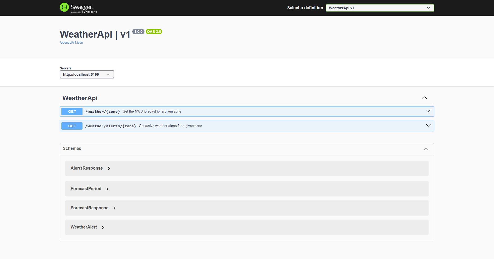
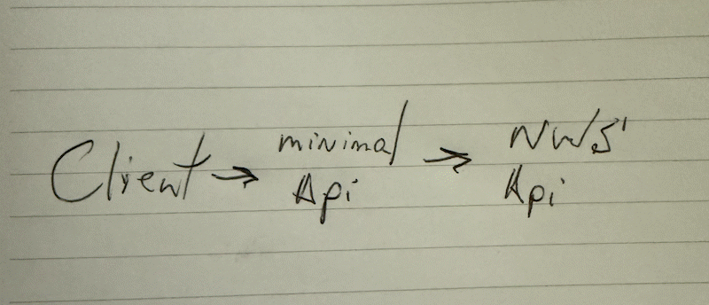

# Round 3: Vision + Code Understanding

## The Prompt

> Provide a screenshot of:
> - The Swagger UI page showing the `/weather/{city}` endpoint
> - A hand-drawn architecture diagram showing: Client → Minimal API → NWS API
>
> Ask: "Based on this architecture, add an in-memory caching layer so we don't hit the NWS API more than once per city per 15 minutes. Show me the code changes needed."

## Starting Point

A working .NET 9 Minimal API with a `/weather/{city}` endpoint, properly configured with the `User-Agent` header (the expected output of Round 2). See the `WeatherApi/` project in this folder.

## Requirements

- Add `IMemoryCache` via Microsoft's caching abstractions
- Cache forecast responses per city for 15 minutes
- Use cache keys based on city name (case-insensitive)
- Return cached data when available, call NWS API only on cache miss

## Visual Input

During the live challenge, the model will receive these two images:

### 1. Swagger UI Screenshot

### 2. Hand-Drawn Architecture Diagram

The model must interpret these visuals and propose the caching layer insertion point.

## Evaluation Criteria

| Criteria | Weight | What We're Looking For |
|----------|--------|----------------------|
| Correctness | 30% | Caching works, stale data expires after 15 min |
| .NET Idioms | 20% | Proper use of `IMemoryCache`, DI registration, `MemoryCacheEntryOptions` |
| Tool Compliance | 20% | Correctly interprets screenshot/diagram context |
| Completeness | 15% | Endpoint cached with distinct keys per city |
| Speed | 15% | Time to first token + total generation time |
